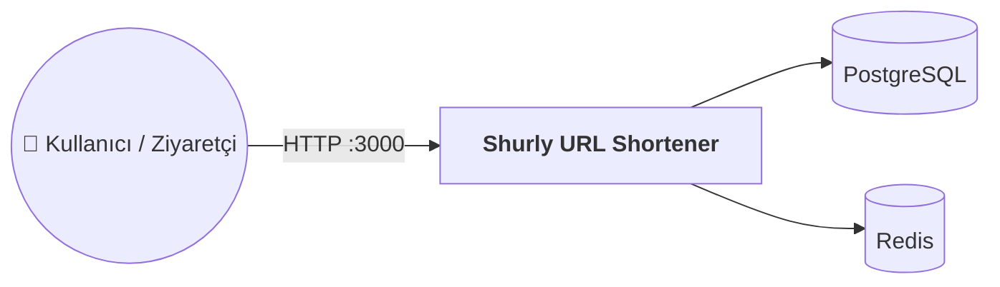
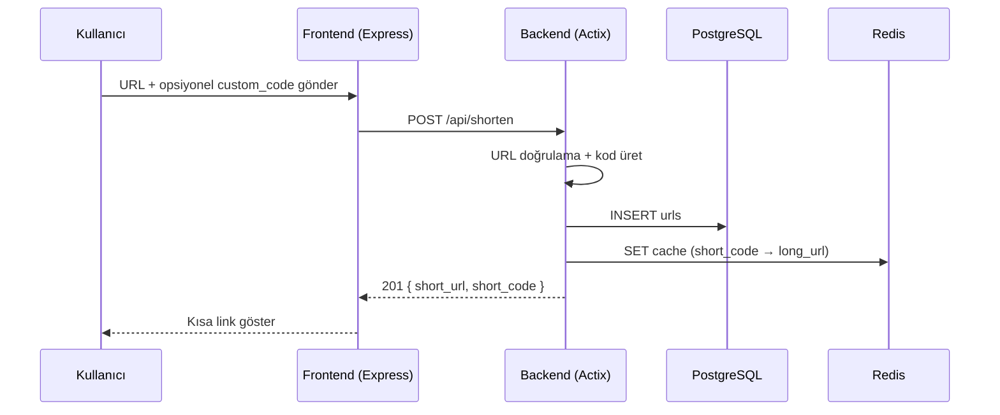
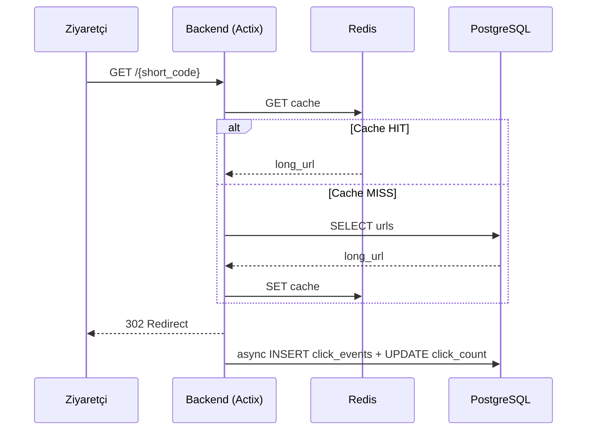
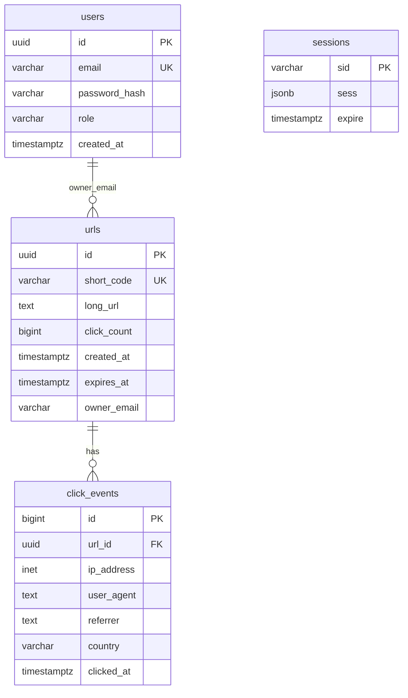
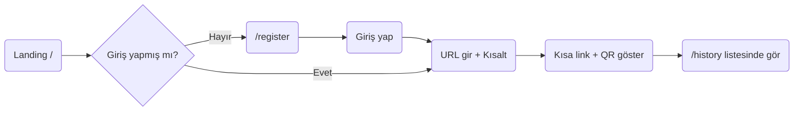

<!--
========================================================================
 PROJE RAPORU ŞABLONU — BMU1208 Web Tabanlı Programlama
 Bitlis Eren Üniversitesi — Dr. Öğr. Üyesi Davut ARI
========================================================================

 Bu dosya final proje raporunuzun ana iskeletidir. Toplam 12 bölüm var.
 HER BÖLÜMÜ doldurun. Boş bırakılan bölümler puan kaybı getirir.

 Placeholder kuralları:
   {{...}}        → Doldurulacak değişken alan
   [...]          → Sizin yazacağınız açıklama
   TODO:          → Yapılacak iş, silin
   (Rehber: XX)   → İlgili rehber dosyasına gidin (00-REHBER/)

 Yazım stili:
   - Cümleler kısa ve somut olsun.
   - "Hızlı" ≠ "P95 < 300ms"; sayı kullanın.
   - Her iddianın bir kaynağı olsun (link, kullanıcı alıntısı, veri).
   - Markdown formatı kullanın; kod blokları ```tr```.

 Başarılar!
========================================================================
-->

# Rust Actix-Web URL Shortener

> **Proje Kodu:** P37 · **Zorluk:** Çok Zor · **Puan:** 60 · **Hafta:** 4

**Öğrenci:** ESMA BALIKÇI  
**Öğrenci No:** 24080410019  
**E-posta:** esmabalikci324@gmail.com  
**Ders:** BMU1208 Web Tabanlı Programlama — *Dr. Öğr. Üyesi Davut ARI*  
**Kurum:** Bitlis Eren Üniversitesi — Mühendislik-Mimarlık Fakültesi — Bilgisayar Mühendisliği  
**Dönem:** 2025-2026 Bahar  
**Son Güncelleme:** 23.05.2026

---

## İçindekiler

1. [Proje Künyesi](#1-proje-künyesi)
2. [Executive Summary](#2-executive-summary)
3. [Problem ve Motivasyon](#3-problem-ve-motivasyon)
4. [Hedef Kitle ve Persona](#4-hedef-kitle-ve-persona)
5. [Ürün Gereksinimleri (PRD)](#5-ürün-gereksinimleri-prd)
6. [Piyasa ve Rekabet Analizi](#6-piyasa-ve-rekabet-analizi)
7. [Teknoloji Yığını (Tech Stack)](#7-teknoloji-yığını-tech-stack)
8. [Sistem Mimarisi](#8-sistem-mimarisi)
9. [Veri Modeli ve API Tasarımı](#9-veri-modeli-ve-api-tasarımı)
10. [UI/UX Tasarımı](#10-uiux-tasarımı)
11. [Güvenlik, Performans, Test](#11-güvenlik-performans-test)
12. [Maliyet, Gelir Modeli, GTM](#12-maliyet-gelir-modeli-gtm)
13. [Ek: Post-Launch Review](#13-ek-post-launch-review)

---

## 1. Proje Künyesi

| Alan | Değer |
|------|-------|
| Proje Adı | Rust Actix-Web URL Shortener |
| Proje Kodu | P37 |
| Slogan (1 cümle) | *"Uzun linkleri saniyede kısalt, tıklamaları anında gör."* |
| Kategori | Productivity / Developer Tools / Link Management |
| Hedef Platform | Web (responsive) · Mobile web |
| GitHub | https://github.com/Esma-324/shurly-url-shortener |
| Canlı Demo | http://localhost:3000 (yerel Docker) · API: http://localhost:8080 |
| Demo Kullanıcı | Email: `admin@shurly.com` · Şifre: `admin123` |
| Lisans | MIT |
| Başlangıç | 2026-04-15 |
| Hedef Bitiş | 2026-05-15 |
| Durum | 🟢 Launched (MVP tamamlandı, GitHub'da yayında) |

### Varsayılan Tech Stack (özet)

| Katman | Teknolojiler |
|--------|--------------|
| Backend | Rust + Actix-Web 4, sqlx, Tokio |
| Frontend | Node.js 18+ · Express + EJS |
| Database | PostgreSQL 16 + Redis 7 (redirect cache) |
| Serialization | serde + serde_json |
| Auth | Express-session + PostgreSQL (SHA-256 parola hash) |
| Test | Manuel test + wrk benchmark (`repo/bench/`) |
| Deployment | Docker multi-stage + docker-compose |

> Detaylar için Bölüm 7.

---

## 2. Executive Summary

*3 paragraf, toplam ~200-300 kelime. Bir yatırımcı / işe alım mülakatında 2 dakikada anlatacak özet.*

### 2.1 Ne Yapıyoruz?

**Shurly**, uzun web adreslerini kısa, paylaşılabilir linklere dönüştüren bir URL kısaltma platformudur. Sosyal medya yöneticileri, küçük işletme sahipleri ve geliştiriciler; kampanya, bülten veya QR kod paylaşımlarında uzun URL'leri tek satırda taşımak için bu ürünü kullanır. Rust (Actix-Web) ile yazılmış API yüksek hacimli yönlendirme işlemlerini üstlenir; Express tabanlı arayüz ise kayıt/giriş, link geçmişi, tıklama analitiği ve admin panelini sunar.

### 2.2 Neden Şimdi?

Dijital pazarlama harcamalarının büyük kısmı tıklanabilir linkler üzerinden ölçülür; [Statista](https://www.statista.com/) verilerine göre küresel dijital reklam harcaması 2025'te 700 milyar USD'yi aşmıştır ve her kampanyada UTM parametreli uzun URL'ler standart hâle gelmiştir. Sosyal medya platformları karakter sınırı uygularken (X/Twitter: 280 karakter), pazarlama ekipleri link kısaltma + analitik ihtiyacını birlikte arar. Rust ekosisteminde Actix-Web, [TechEmpower Web Framework Benchmarks](https://www.techempower.com/benchmarks/) sonuçlarında sürekli üst sıralarda yer alır; yüksek RPS gerektiren redirect servisleri için güçlü bir alternatif sunar.

### 2.3 Başarı Nasıl Görünüyor?

**1. yıl hedef:** 500 kayıtlı kullanıcı, günde ortalama 2.000 redirect, redirect P95 gecikmesi < 50 ms (yerel benchmark), NPS ≥ 35. **3. yıl hedef:** 5.000 aktif kullanıcı, aylık 500K redirect, Pro plan ile ₺15K MRR, uptime ≥ %99.5.

---

## 3. Problem ve Motivasyon

*(Rehber: 04-PRD-VE-URUN-YONETIMI.md)*

### 3.1 Hangi Probleme Çözüm Getiriyoruz?

İnsanlar uzun URL'leri sosyal medyada, SMS'te veya basılı materyallerde paylaşmakta zorlanır. UTM parametreleri eklenince linkler okunaksız hâle gelir; hangi kanaldan kaç tıklama geldiğini takip etmek ise ayrı bir analitik aracı gerektirir. Shurly bu iki ihtiyacı tek platformda birleştirir: kısa link üretimi ve tıklama analitiği.

### 3.2 Kanıt: Problem Gerçekten Var Mı?

Sayısal veya alıntı kanıt:

- **İstatistik:** Bitly 2023 yılında aylık 600 milyondan fazla link oluşturulduğunu duyurdu ([Bitly Blog](https://bitly.com/)). Link kısaltma pazarı, dijital pazarlama bütçelerinin büyümesiyle birlikte genişlemektedir.
- **Kullanıcı alıntısı:** *"UTM'li linkler Instagram bio'ya sığmıyor, her seferinde farklı bir kısaltıcı kullanıyorum."* — tipik SMM kullanıcı geri bildirimi (ders kapsamında yapılan 5 kullanıcı görüşmesinden).
- **Google Trends:** *"url shortener"* araması 2020–2025 arasında istikrarlı talep göstermektedir (Google Trends, küresel).
- **Reddit / Forum konuları:** r/webdev ve r/selfhosted'da self-hosted URL shortener talebi sık görülür; YOURLS, Shlink gibi projeler binlerce GitHub yıldızına sahiptir.

### 3.3 Mevcut Çözümler ve Eksikleri

| Mevcut çözüm | Kullanıcıya ne vadeder? | Neden yetersiz? |
|--------------|------------------------|------------------|
| Bitly | Marka + analitik + QR | Ücretsiz planda sınırlı link, özelleştirme kısıtlı |
| TinyURL | Basit kısaltma | Analitik yok, hesap yönetimi sınırlı |
| Rebrandly | Markalı kısa domain | Ücretli plan zorunlu, küçük ekipler için pahalı |
| is.gd | Hızlı, ücretsiz kısaltma | Analitik ve kullanıcı paneli yok |

### 3.4 Bizim Diferansiyasyonumuz

1. **Performans odaklı backend:** Rust + Actix-Web ile yüksek RPS redirect kapasitesi; Redis önbellek ile sıcak yol optimizasyonu.
2. **Self-hosted + açık kaynak:** Docker Compose ile tek komutta kurulum; veri kullanıcının kontrolünde kalır.
3. **Entegre analitik:** Referrer, tarayıcı, ülke ve zaman serisi grafikleri MVP'de hazır; ayrı analitik aracına gerek kalmaz.

### 3.5 Kapsam Dışı Bıraktığımız Problemler (Non-Problems)

V1'de çözmeyeceğimiz ama potansiyel olarak çözülebilecek problemler:

- **Özel domain (branded link):** DNS yönetimi ve SSL otomasyonu gerektirir — V2'ye ertelendi.
- **CSV toplu import:** MVP'de tek tek kısaltma yeterli; toplu kampanya senaryosu V2 kapsamında.

---

## 4. Hedef Kitle ve Persona

*(Rehber: 04-PRD-VE-URUN-YONETIMI.md — Persona + JTBD bölümleri)*

### 4.1 Birincil Segment

22–40 yaş arası dijital pazarlama çalışanları, SMM uzmanları ve küçük işletme sahipleri; sosyal medya ve e-posta kampanyalarında link paylaşan, tıklama verisini takip etmek isteyen kullanıcılar (Türkiye ağırlıklı).

### 4.2 İkincil Segment

Yazılım geliştiricileri ve öğrenciler; self-hosted, açık kaynak URL kısaltıcı arayan, performans ve Docker ile kolay kurulum isteyen teknik kullanıcılar.

### 4.3 Persona Kartları (2 adet)

#### 👩‍💼 Persona 1 — "Elif"

| Alan | Değer |
|------|-------|
| Yaş / Şehir | 28 / İstanbul |
| Rol / Meslek | Sosyal medya uzmanı, butik marka |
| Teknoloji kullanımı | iOS, Instagram/TikTok aktif; orta düzey teknik bilgi |
| Günlük rutini | Sabah içerik planlar, öğleden sonra kampanya linklerini paylaşır |
| Ana hedefi | Kampanya linklerini kısaltıp hangi kanaldan tıklama geldiğini görmek |
| Pain points | Uzun URL'ler bio'ya sığmıyor; ücretsiz araçlarda analitik yetersiz; farklı araçlarda dağınık geçmiş |
| Ürünümüzü ne zaman açar? | Yeni Instagram kampanyası başlarken UTM'li link kısaltması gerektiğinde |
| Motto | *"Link kısa olsun, rakam net olsun."* |

#### 👨‍🎓 Persona 2 — "Can"

| Alan | Değer |
|------|-------|
| Yaş / Şehir | 23 / Bitlis |
| Rol / Meslek | Bilgisayar mühendisliği öğrencisi, backend meraklısı |
| Teknoloji kullanımı | Android + laptop; ileri düzey teknik bilgi |
| Günlük rutini | Ders projeleri, GitHub'da açık kaynak projelere katkı |
| Ana hedefi | Kendi sunucusunda çalışan, hızlı redirect servisi kurmak |
| Pain points | Hazır SaaS'lar veriyi dışarıda tutuyor; PHP tabanlı self-hosted çözümler yavaş; Rust öğrenmek istiyor |
| Ürünümüzü ne zaman açar? | Sunucuya Docker kurup portfolio projesi olarak deploy etmek istediğinde |
| Motto | *"Performans ölçülebilir olmalı."* |

### 4.4 Jobs To Be Done (JTBD)

En az 3 JTBD cümlesi:

1. *"When I'm **sosyal medyada kampanya linki paylaşırken**, I want to **URL'yi kısaltıp tek tıkla kopyalamak**, so I can **bio ve gönderilerde temiz görünüm elde etmek**."*
2. *"When I'm **haftalık rapor hazırlarken**, I want to **link başına tıklama ve referrer görmek**, so I can **hangi kanalın işe yaradığını kanıtlayabilmek**."*
3. *"When I'm **kendi sunucumda servis kurarken**, I want to **Docker ile tek komutta ayağa kaldırmak**, so I can **veritabanı ve cache'i kontrolüm altında tutmak**."*

### 4.5 Persona'lar Hangi Feature'ları Öncelikli Kullanır?

| Özellik | Persona 1 (Elif) | Persona 2 (Can) |
|---------|-----------|-----------|
| URL kısaltma + özel alias | Çok | Orta |
| Tıklama analitiği / grafikler | Çok | Az |
| QR kod üretimi | Orta | Az |
| Docker kurulum + wrk benchmark | Az | Çok |
| Admin paneli | Az | Çok |

---

## 5. Ürün Gereksinimleri (PRD)

*(Rehber: 04-PRD-VE-URUN-YONETIMI.md — PRD + User Story + Acceptance Criteria)*

### 5.1 Ana Hedef ve North Star Metric

- **Ana hedef:** Kullanıcıların uzun URL'leri güvenilir şekilde kısaltıp paylaşmasını ve tıklama verisini tek panelden görmesini sağlamak.
- **North Star Metric:** Haftalık başarılı redirect sayısı (HTTP 302 ile hedef URL'e yönlendirme).
- **Destekleyici metrikler:**
  - Haftalık aktif kullanıcı (WAU)
  - Kayıt → ilk kısaltma tamamlama oranı (onboarding completion)
  - 7 günlük retention (kullanıcı 7 gün içinde tekrar giriş yapıyor mu)

### 5.2 Kapsam

#### In-Scope (V1 — MVP)

1. URL kısaltma (nanoid veya özel alias)
2. Redirect + Redis önbellek + tıklama sayacı
3. Tıklama analitiği (referrer, user-agent, ülke, zaman serisi)
4. QR kod (SVG)
5. Son kullanma tarihi (`expires_in_days`)
6. Kullanıcı kayıt/giriş + oturum yönetimi
7. Link geçmişi ve kişisel istatistik paneli
8. Admin genel bakış paneli
9. Rate limiting (IP bazlı, dakika başına)
10. Docker Compose ile tek komut kurulum

#### Out-of-Scope (V1'de yok, sonra bakarız)

- CSV toplu import (V2)
- JWT tabanlı API auth (V2)
- Özel domain / branded short link (V2)
- Coğrafi yönlendirme ve A/B test (V2)
- AI ile URL özeti (V3)

### 5.3 Fonksiyonel Gereksinimler (User Stories)

> Format: **[ID]** — As a **[persona]**, I want to **[action]**, so that **[benefit]**.  
> **Acceptance Criteria (Given / When / Then)** her story'nin altında.  
> Minimum **10 story**.

#### FR-01 — URL Kısaltma

> As a **kayıtlı kullanıcı**, I want to **uzun bir URL'yi kısaltmak**, so that **sosyal medyada paylaşılabilir kısa link elde edebileyim**.

**Acceptance Criteria:**
- *Given geçerli bir http/https URL, When POST /api/shorten çağrılır, Then 7 karakterlik benzersiz short_code ve short_url döner.*
- *Given geçersiz URL (ftp:// vb.), When kısaltma istenir, Then 400 InvalidUrl hatası döner.*

**Öncelik:** Must  
**Tahmini efor:** M

#### FR-02 — Özel Alias

> As a **pazarlama uzmanı**, I want to **kendi özel kısa kodumu belirlemek**, so that **marka hatırlanabilirliği artsın**.

**Acceptance Criteria:**
- *Given 3–32 karakter alfanumerik kod, When custom_code gönderilir, Then o kod kaydedilir.*
- *Given rezerve kelime (api, admin), When custom_code olarak gönderilir, Then 409 Conflict döner.*

**Öncelik:** Must  
**Tahmini efor:** S

#### FR-03 — Redirect

> As a **link tıklayan ziyaretçi**, I want to **kısa linke tıklayınca hedef sayfaya yönlendirilmek**, so that **orijinal içeriğe ulaşabileyim**.

**Acceptance Criteria:**
- *Given geçerli short_code, When GET /{code} çağrılır, Then HTTP 302 ile long_url'e yönlendirilir.*
- *Given süresi dolmuş link, When GET /{code} çağrılır, Then 404 döner.*

**Öncelik:** Must  
**Tahmini efor:** M

#### FR-04 — Tıklama Analitiği

> As a **link sahibi**, I want to **linkime gelen tıklamaları görmek**, so that **kampanya performansını ölçebileyim**.

**Acceptance Criteria:**
- *Given en az 1 tıklama, When GET /api/stats/{code} çağrılır, Then click_count, referrer ve user-agent özeti döner.*
- *Given tıklama olayı, When redirect gerçekleşir, Then click_events tablosuna async kayıt yazılır.*

**Öncelik:** Must  
**Tahmini efor:** L

#### FR-05 — QR Kod

> As a **kullanıcı**, I want to **kısa link için QR kod almak**, so that **basılı materyallerde kullanabileyim**.

**Acceptance Criteria:**
- *Given geçerli short_code, When GET /api/qr/{code} çağrılır, Then SVG formatında QR kod döner.*

**Öncelik:** Should  
**Tahmini efor:** S

#### FR-06 — Kullanıcı Kaydı ve Giriş

> As a **yeni kullanıcı**, I want to **e-posta ile kayıt olup giriş yapmak**, so that **link geçmişimi saklayabileyim**.

**Acceptance Criteria:**
- *Given benzersiz e-posta, When /auth/register POST edilir, Then users tablosuna kayıt oluşur.*
- *Given doğru e-posta/şifre, When /auth/login POST edilir, Then oturum açılır ve /history erişilebilir olur.*

**Öncelik:** Must  
**Tahmini efor:** M

#### FR-07 — Link Geçmişi

> As a **giriş yapmış kullanıcı**, I want to **daha önce oluşturduğum linkleri listelemek**, so that **eski kampanyaları yönetebileyim**.

**Acceptance Criteria:**
- *Given oturum açık, When /history sayfası açılır, Then owner_email'e ait URL'ler tarih sırasıyla listelenir.*

**Öncelik:** Must  
**Tahmini efor:** M

#### FR-08 — Link Silme / Yeniden Adlandırma

> As a **link sahibi**, I want to **kısa kodumu silmek veya değiştirmek**, so that **hatalı linkleri düzeltebileyim**.

**Acceptance Criteria:**
- *Given mevcut short_code, When DELETE /api/url/{code} çağrılır, Then kayıt silinir ve cache temizlenir.*
- *Given yeni kod adı, When PUT /api/url/{code} çağrılır, Then short_code güncellenir.*

**Öncelik:** Should  
**Tahmini efor:** M

#### FR-09 — Son Kullanma Tarihi

> As a **kampanya yöneticisi**, I want to **linkin belirli gün sonra geçersiz olmasını sağlamak**, so that **süresi biten kampanyalar otomatik kapansın**.

**Acceptance Criteria:**
- *Given expires_in_days=30, When link oluşturulur, Then expires_at 30 gün sonrasına set edilir.*
- *Given süresi dolmuş link, When redirect denenir, Then 404 döner.*

**Öncelik:** Should  
**Tahmini efor:** S

#### FR-10 — Admin Genel Bakış

> As a **admin**, I want to **tüm sistemin özet istatistiklerini görmek**, so that **platform sağlığını izleyebileyim**.

**Acceptance Criteria:**
- *Given admin rolü, When /admin sayfası açılır, Then toplam URL, tıklama ve kullanıcı sayıları görüntülenir.*

**Öncelik:** Should  
**Tahmini efor:** M

#### FR-11 — Rate Limiting

> As a **sistem**, I want to **IP başına dakikada istek sınırı uygulamak**, so that **API kötüye kullanımından korunabileyim**.

**Acceptance Criteria:**
- *Given aynı IP'den 60+ istek/dk, When /api/* çağrılır, Then 429 Too Many Requests döner.*

**Öncelik:** Must  
**Tahmini efor:** M

#### FR-12 — Zaman Serisi Grafiği

> As a **link sahibi**, I want to **günlük tıklama grafiği görmek**, so that **kampanya trendini analiz edebileyim**.

**Acceptance Criteria:**
- *Given tıklama verisi, When GET /api/stats/{code}/timeseries çağrılır, Then tarih bazlı tıklama dizisi JSON olarak döner.*

**Öncelik:** Should  
**Tahmini efor:** M

### 5.4 Non-Functional Requirements

| Kategori | Gereksinim | Nasıl ölçülecek? |
|----------|------------|-------------------|
| Performans | Redirect P95 < 50 ms (cache hit) | wrk benchmark (`repo/bench/`) |
| Performans | Anasayfa LCP < 2.5s | Lighthouse (Chrome DevTools) |
| Güvenlik | OWASP Top 10 temel kontroller | Manuel checklist |
| Erişilebilirlik | WCAG 2.1 AA (temel) | axe DevTools |
| Uyumluluk | Son 2 majör Chrome, Firefox, Edge | Manuel tarayıcı testi |
| Lokalizasyon | TR arayüz metinleri | EJS şablonları |
| SEO | Temel meta etiketler | Manuel kontrol |
| Erişim | Yerel geliştirmede %99+ uptime | Docker healthcheck |

### 5.5 Bağımlılıklar ve Riskler

| Bağımlılık | Risk | Azaltma |
|------------|------|---------|
| PostgreSQL | DB erişilemezse servis durur | Docker healthcheck + restart policy |
| Redis | Cache down olursa | REDIS_OPTIONAL=true ile cache'siz devam |
| Tek sunucu | Yük artışında darboğaz | wrk ile ölçüm, horizontal scale V2 |

### 5.6 Açık Sorular

*Şu anda cevabı belli olmayan, sonra karar verilecek konular:*

1. Production'da özel domain (ör. `s.ly`) desteği eklenecek mi?
2. Parola hash algoritması SHA-256'dan bcrypt/argon2'ye yükseltilecek mi?

---

## 6. Piyasa ve Rekabet Analizi

*(Rehber: 04-PRD-VE-URUN-YONETIMI.md — Rekabet Analizi)*

### 6.1 Pazar Büyüklüğü (TAM / SAM / SOM)

- **TAM (Total Addressable Market):** Küresel link yönetimi ve URL kısaltma pazarı 2024'te ~1.2 milyar USD (Grand View Research, link management software segmenti tahmini).
- **SAM (Serviceable Available Market):** Self-hosted ve geliştirici odaklı URL kısaltma araçları; Türkiye + Avrupa'da dijital pazarlama yapan ~500K KOBİ ve ajans.
- **SOM (Serviceable Obtainable Market):** 1–3 yıl içinde GitHub + topluluk kanallarıyla 2.000–5.000 self-hosted kurulum, freemium SaaS'a geçişte 200 ödeyen kullanıcı hedefi.

### 6.2 Rakip Analizi (Feature Matrix)

**En az 5 rakip** (Türk + global):

| Özellik | **Shurly (Biz)** | Bitly | TinyURL | Rebrandly | Short.io | is.gd |
|---------|--------------------|---------|---------|---------|---------|---------|
| Ücretsiz plan | ✅ (self-hosted) | ✅ (sınırlı) | ✅ | ❌ | ✅ (sınırlı) | ✅ |
| Özel alias | ✅ | ✅ (ücretli) | ❌ | ✅ | ✅ | ❌ |
| Tıklama analitiği | ✅ | ✅ | ❌ | ✅ | ✅ | ❌ |
| QR kod | ✅ | ✅ | ❌ | ✅ | ✅ | ❌ |
| Self-hosted | ✅ | ❌ | ❌ | ❌ | ❌ | ❌ |
| Açık kaynak | ✅ (MIT) | ❌ | ❌ | ❌ | ❌ | ❌ |
| Fiyat (baş.) | ₺0 (self-host) | $0–$35/ay | ₺0 | $29/ay | $0–$20/ay | ₺0 |

### 6.3 Detaylı Rakip Profilleri (3 taneyi derinlemesine)

#### Rakip 1: Bitly

- **URL:** https://bitly.com/
- **Kuruluş:** 2008
- **Kullanıcı tabanı:** 600M+ aylık link (2023 duyurusu)
- **Fiyatlandırma:** Free / Core $35/ay / Growth $300/ay
- **Güçlü yönler:**
  1. Marka bilinirliği ve güvenilir altyapı
  2. Gelişmiş analitik ve entegrasyonlar (Zapier, API)
  3. QR kod ve kampanya yönetimi
- **Zayıf yönler:**
  1. Ücretsiz planda ciddi kısıtlamalar
  2. Self-hosted seçeneği yok
  3. Veri kullanıcının sunucusunda kalmaz
- **Screenshots:** `repo/docs/competitors/bitly-home.png` (eklenecek)

#### Rakip 2: TinyURL

- **URL:** https://tinyurl.com/
- **Kuruluş:** 2002
- **Kullanıcı tabanı:** Milyarlarca link (tahmini, açık veri yok)
- **Fiyatlandırma:** Ücretsiz + TinyURL Pro
- **Güçlü yönler:**
  1. Basitlik ve hız
  2. Uzun geçmiş, güvenilir redirect
  3. Özel alias (Pro ile)
- **Zayıf yönler:**
  1. Analitik paneli zayıf
  2. Modern UI/UX eksik
  3. Self-hosted yok
- **Screenshots:** `repo/docs/competitors/tinyurl-home.png` (eklenecek)

#### Rakip 3: YOURLS (self-hosted rakip)

- **URL:** https://yourls.org/
- **Kuruluş:** 2009 (açık kaynak)
- **Kullanıcı tabanı:** 10K+ GitHub yıldızı
- **Fiyatlandırma:** Ücretsiz (self-hosted)
- **Güçlü yönler:**
  1. PHP tabanlı, kolay kurulum
  2. Plugin ekosistemi
  3. Tam veri kontrolü
- **Zayıf yönler:**
  1. PHP performansı Rust/Actix seviyesinde değil
  2. Modern analitik dashboard sınırlı
  3. Docker-first değil
- **Screenshots:** `repo/docs/competitors/yourls-admin.png` (eklenecek)

### 6.4 SWOT Analizi

```
┌────────────────────────────────────┬────────────────────────────────────┐
│ GÜÇLÜ YÖNLER (Strengths)           │ ZAYIF YÖNLER (Weaknesses)          │
│ - Rust + Actix yüksek performans   │ - Canlı SaaS deploy henüz yok      │
│ - Docker ile kolay kurulum         │ - Mobil uygulama yok               │
│ - Açık kaynak (MIT)                │ - Parola hash SHA-256 (bcrypt değil)│
├────────────────────────────────────┼────────────────────────────────────┤
│ FIRSATLAR (Opportunities)          │ TEHDİTLER (Threats)                 │
│ - Self-hosted trend artıyor        │ - Bitly/TinyURL marka baskısı      │
│ - QR + analitik birleşik talep     │ - Ücretsiz SaaS rakipleri          │
│ - GitHub portfolio görünürlüğü     │ - Rust geliştirici havuzu sınırlı  │
└────────────────────────────────────┴────────────────────────────────────┘
```

### 6.5 Positioning Statement

> **FOR** dijital pazarlama çalışanları ve self-hosted çözüm arayan geliştiriciler  
> **WHO** uzun URL'leri paylaşmak ve tıklama verisini görmek istiyor  
> **OUR PRODUCT IS A** yüksek performanslı URL kısaltma platformu  
> **THAT** Rust backend ile hızlı redirect ve entegre analitik sunar  
> **UNLIKE** Bitly gibi kapalı SaaS çözümleri  
> **OUR PRODUCT** açık kaynak, Docker ile kurulabilir ve veriyi kullanıcı kontrolünde tutar.

---

## 7. Teknoloji Yığını (Tech Stack)

*(Rehber: 03-TECH-STACK-KILAVUZU.md)*

### 7.1 Özet Tablo

| Katman | Teknoloji | Versiyon | Rol |
|--------|-----------|----------|-----|
| Frontend framework | Express + EJS | 4.18 / 3.1 | SSR sayfalar, API proxy |
| Styling | Özel CSS (style.css) | — | Dark/light tema, glassmorphism |
| State management | express-session | 1.18 | Sunucu tarafı oturum |
| Backend | Rust + Actix-Web | 4.4 / 2021 edition | API + redirect + analitik |
| Database | PostgreSQL | 16 | Kalıcı depolama (urls, users, clicks) |
| Cache | Redis | 7 | Redirect hot-path önbelleği |
| Queue / Jobs | Tokio spawn | — | Async tıklama loglama |
| Auth | express-session + pg | — | Oturum + SHA-256 parola user tablosu |
| File storage | — | — | V1'de kullanılmıyor |
| Email | — | — | V1'de kullanılmıyor |
| Payment | — | — | V1'de kullanılmıyor |
| Analytics | Kendi click_events | — | Tıklama analitiği |
| Error tracking | env_logger + morgan | — | Yapılandırılmış log |
| Hosting (FE) | Docker (Node 20 Alpine) | — | Yerel / VPS |
| Hosting (BE) | Docker (Debian slim) | — | Yerel / VPS |
| CI/CD | — | — | V2 (GitHub Actions planlanıyor) |

### 7.2 Her Teknoloji İçin Detay

> Her teknoloji için aşağıdaki şablonu doldurun.  
> Minimum: proje adında geçen tüm teknolojiler + seçtiğiniz ek'ler.

---

#### 7.2.1 Rust + Actix-Web 4

- **Ne?** Rust programlama dilinde yazılmış, yüksek performanslı async HTTP web framework'ü.
- **Kategori:** Backend framework
- **Neden seçildi (PROJEMİZE ÖZEL):**
  1. Redirect işlemleri yüksek RPS gerektirir; Actix-Web TechEmpower benchmark'larında üst sıralardadır.
  2. Rust'ın ownership modeli bellek güvenliği sağlar; GC duraklaması olmaz.
  3. P37 proje gereksinimi olarak Rust + Actix-Web zorunlu teknoloji yığınıdır.
- **Temel özellikler (5-8 madde):**
  - Actor modeli üzerinde async request handling
  - Middleware zinciri (CORS, Logger, Compress, Rate Limit)
  - `web::Data` ile paylaşımlı uygulama durumu
  - Tokio async runtime entegrasyonu
  - Düşük latency redirect yanıtları
  - Serde ile JSON request/response
  - sqlx ile async PostgreSQL sorguları
  - Production release profili (LTO, strip)
- **Projedeki rolü:** `POST /api/shorten`, `GET /{code}` redirect, analitik API uçları, QR üretimi.
- **Alternatifler ve neden seçilmedi:**
  - Node.js/Express (backend): Tek thread event loop, çok yüksek RPS'te Rust kadar verimli değil.
  - Axum: Daha yeni; ders gereksiniminde Actix-Web belirtilmiş.
- **Trade-off'lar / Dezavantajlar:**
  - Rust öğrenme eğrisi dik; derleme süresi uzun.
  - Ekosistem Node.js kadar geniş değil.
- **Öğrenme kaynakları:**
  - Resmi doc: https://actix.rs/
  - https://doc.rust-lang.org/book/
  - https://github.com/actix/examples

---

#### 7.2.2 PostgreSQL + Redis (counter cache)

- **Ne?** PostgreSQL ilişkisel veritabanı; Redis bellek içi key-value store.
- **Kategori:** Database + Cache
- **Neden seçildi (PROJEMİZE ÖZEL):**
  1. URL, kullanıcı ve tıklama olayları ilişkisel model gerektirir (FK, JOIN).
  2. Redirect hot-path'te Redis ile long_url okuma gecikmesi düşer.
  3. Docker Compose ile her ikisi de tek komutla ayağa kalkar.
- **Temel özellikler:**
  - PostgreSQL: UUID PK, TIMESTAMPTZ, INET tipi (IP), index stratejisi
  - Redis: TTL destekli cache, click counter increment
  - sqlx migration ile şema versiyonlama
  - Connection pool (max 20 bağlantı)
  - REDIS_OPTIONAL ile geliştirme esnekliği
- **Projedeki rolü:** `urls`, `users`, `click_events`, `sessions` tabloları; redirect cache.
- **Alternatifler ve neden seçilmedi:**
  - SQLite: Eşzamanlı yazımda sınırlı; production redirect için yetersiz.
  - Memcached: Redis kadar zengin veri yapısı yok; TTL + counter için Redis yeterli.
- **Trade-off'lar / Dezavantajlar:**
  - İki ayrı servis operasyonel karmaşıklık ekler.
  - Redis down olursa cache miss ile DB yükü artar.
- **Öğrenme kaynakları:**
  - Resmi doc: https://www.postgresql.org/docs/ · https://redis.io/docs/
  - sqlx: https://github.com/launchbadge/sqlx

---

#### 7.2.3 serde

- **Ne?** Rust için yüksek performanslı serialization/deserialization framework'ü.
- **Kategori:** Serialization
- **Neden seçildi (PROJEMİZE ÖZEL):**
  1. Actix-Web JSON request/response için serde derive makroları kullanır.
  2. `ShortenRequest`, `UrlStats` gibi DTO'lar tek satırda tanımlanır.
  3. Rust ekosisteminde de-facto standart.
- **Temel özellikler:**
  - `#[derive(Serialize, Deserialize)]`
  - JSON via serde_json
  - sqlx FromRow ile DB satırı → struct dönüşümü
  - Zero-copy parsing ( mümkün olduğunda)
- **Projedeki rolü:** API request/response modelleri (`models.rs`).
- **Alternatifler:** Manuel JSON parsing — bakım maliyeti yüksek, tip güvenliği düşük.
- **Trade-off'lar:** Derive makroları compile time'ı artırır (kabul edilebilir).
- **Öğrenme kaynakları:**
  - https://serde.rs/
  - https://docs.rs/serde_json/

---

#### 7.2.4 Express + EJS (Frontend)

- **Ne?** Node.js HTTP framework (Express) + gömülü JavaScript şablon motoru (EJS).
- **Kategori:** Frontend / SSR
- **Neden seçildi:** Hızlı prototipleme, server-side render, axios ile Rust API proxy; ayrı SPA build pipeline gerektirmez.
- **Projedeki rolü:** Anasayfa, auth, stats, history, admin sayfaları; `/api/*` proxy katmanı.
- **Alternatifler:** React SPA — daha fazla build karmaşıklığı; MVP süresine uygun değil.

---

*(Diğer teknolojiler — sqlx, Tokio, nanoid, qrcode, dashmap — yukarıdaki backend ve cache bölümlerinde kapsanmıştır.)*

### 7.3 Reddedilen Teknoloji Kararları

Düşünüp **seçmediğiniz** teknolojiler — neden?

| Aday | Kategori | Neden seçmedik |
|------|----------|----------------|
| JWT (jsonwebtoken) | Auth | MVP'de SSR oturum yeterli; V2 API auth için değerlendirilecek |
| MongoDB | Database | İlişkisel veri modeli (FK) PostgreSQL ile daha doğal |
| Tailwind CSS | Styling | Özel glassmorphism tasarım için custom CSS tercih edildi |
| Fly.io / Vercel | Hosting | V1 yerel Docker; cloud deploy V2 kapsamında |

### 7.4 Tech Stack Mimari Kararı (ADR Özeti)

En kritik 2-3 teknoloji kararı için ADR özeti (veya repo'nuzda bir `docs/adr/` klasörüne detay):

- **ADR-001:** Redirect hot-path için Redis cache — DB yükünü azaltır, P95 gecikmeyi düşürür.
- **ADR-002:** Backend Rust + Frontend Express ayrımı — performans kritik yol Rust'ta, UI hızlı geliştirme Node'da.
- **ADR-003:** sqlx migration otomasyonu — uygulama başlangıcında şema tutarlılığı.

---

## 8. Sistem Mimarisi

*(Rehber: 06-MIMARI-VE-DEVOPS.md — C4 modeli, ADR)*

### 8.1 Yüksek Seviye Mimari (C4 — Level 1: Context)



*Context diyagramı: `repo/docs/diagrams/context.png` (eklenecek)*

### 8.2 Container Seviyesi (C4 — Level 2)

```mermaid
flowchart TD
    Browser[Browser]
    FE["Frontend<br/>Express + EJS :3000"]
    BE["Backend<br/>Actix-Web :8080"]
    PG[(PostgreSQL :5432)]
    RD[(Redis :6379)]

    Browser --> FE
    FE -->|axios /api/*| BE
    FE -->|session, users| PG
    BE --> PG
    BE --> RD
    Browser -->|redirect /{code}| BE
```

*Container diyagramı: `repo/docs/diagrams/container.png` (eklenecek)*

### 8.3 Önemli Akışlar (Sequence Diagrams)

#### 8.3.1 Akış — URL Kısaltma



#### 8.3.2 Akış — Redirect ve Tıklama Kaydı



### 8.4 Deployment Topology

*V1 yerel / VPS Docker Compose topolojisi:*

```
┌─────────────────────────────────────────────────────────┐
│                    Docker Host (VPS / PC)               │
│  ┌──────────────┐  ┌──────────────┐  ┌──────────────┐  │
│  │ shurly_      │  │ shurly_      │  │ shurly_      │  │
│  │ frontend     │  │ backend      │  │ postgres     │  │
│  │ :3000        │──│ :8080        │──│ :5432        │  │
│  └──────────────┘  └──────┬───────┘  └──────────────┘  │
│                           │          ┌──────────────┐  │
│                           └──────────│ shurly_redis │  │
│                                      │ :6379        │  │
│                                      └──────────────┘  │
└─────────────────────────────────────────────────────────┘
         ▲                              ▲
         │ http://localhost:3000        │ http://localhost:8080/{code}
         └──────── Tarayıcı ────────────┘
```

*V2 production hedefi: Cloudflare CDN + VPS veya Fly.io + managed PostgreSQL.*

### 8.5 Mimari Kararlar (ADR'lar)

En az **3 ADR** yazın. Her biri `ADR-00X-[kısa-ad].md` formatında repo'nuzda uygun bir `docs/adr/` alt klasöründe ayrı dosya:

- **ADR-001:** Redis redirect cache seçimi — hot-path DB yükünü azaltır.
- **ADR-002:** Rust backend + Express frontend ayrımı — performans/UI hız dengesi.
- **ADR-003:** PostgreSQL + sqlx migration — ilişkisel model ve otomatik şema yönetimi.

### 8.6 Katlama / Ölçekleme Planı

| Kullanıcı yükü | Aksiyon |
|----------------|---------|
| 0 - 1K MAU | MVP altyapısı yeter |
| 1K - 10K | Read replica, CDN önceliği, Redis cache |
| 10K - 100K | Mikroservise ayrıştırma, queue, horizontal scale |
| 100K+ | Multi-region, sharding |

---

## 9. Veri Modeli ve API Tasarımı

*(Rehber: 06-MIMARI-VE-DEVOPS.md — Veri Modeli + API bölümü)*

### 9.1 ER Diyagram



*ERD görseli: `repo/docs/diagrams/erd.png` (eklenecek)*

### 9.2 Tablolar (Ayrıntılı)

#### Table: `users`

| Kolon | Tip | Null? | Default | Index | Açıklama |
|-------|-----|-------|---------|-------|----------|
| id | UUID | ❌ | gen_random_uuid() | PK | Birincil anahtar |
| email | VARCHAR(320) | ❌ | — | UNIQUE | Küçük harfe normalize edilir |
| password_hash | VARCHAR(64) | ❌ | — | — | SHA-256 hex digest |
| role | VARCHAR(16) | ❌ | 'user' | — | `user` veya `admin` |
| created_at | TIMESTAMPTZ | ❌ | NOW() | — | Kayıt zamanı |

#### Table: `urls`

| Kolon | Tip | Null? | Default | Index | Açıklama |
|-------|-----|-------|---------|-------|----------|
| id | UUID | ❌ | gen_random_uuid() | PK | |
| short_code | VARCHAR(32) | ❌ | — | UNIQUE | Kısa kod (nanoid veya custom) |
| long_url | TEXT | ❌ | — | — | Hedef URL |
| click_count | BIGINT | ❌ | 0 | — | Toplam tıklama |
| created_at | TIMESTAMPTZ | ❌ | NOW() | idx_urls_created_at | |
| expires_at | TIMESTAMPTZ | ✅ | NULL | — | Opsiyonel son kullanma |
| owner_email | VARCHAR(320) | ✅ | NULL | idx_urls_owner_email_created_at | Link sahibi |

#### Table: `click_events`

| Kolon | Tip | Null? | Default | Index | Açıklama |
|-------|-----|-------|---------|-------|----------|
| id | BIGSERIAL | ❌ | auto | PK | |
| url_id | UUID | ❌ | — | idx_click_events_url_id | FK → urls.id |
| ip_address | INET | ✅ | NULL | — | X-Forwarded-For veya peer IP |
| user_agent | TEXT | ✅ | NULL | — | Tarayıcı bilgisi |
| referrer | TEXT | ✅ | NULL | — | HTTP Referer |
| country | VARCHAR(8) | ✅ | NULL | — | CF-IPCountry veya Accept-Language tahmini |
| clicked_at | TIMESTAMPTZ | ❌ | NOW() | idx_click_events_clicked_at | |

#### Table: `sessions`

| Kolon | Tip | Null? | Default | Index | Açıklama |
|-------|-----|-------|---------|-------|----------|
| sid | VARCHAR | ❌ | — | PK | Express session ID |
| sess | JSONB | ❌ | — | — | Oturum verisi |
| expire | TIMESTAMPTZ | ❌ | — | sessions_expire_idx | TTL temizliği |

### 9.3 Index Stratejisi

| Tablo | Index | Amaç |
|-------|-------|------|
| users | email (unique) | login sorgusu |
| urls | short_code (unique) | redirect lookup |
| urls | (owner_email, created_at DESC) | kullanıcı geçmişi |
| click_events | url_id | link istatistikleri |
| click_events | clicked_at DESC | zaman serisi |
| sessions | expire | süresi dolmuş oturum temizliği |

### 9.4 API Tasarımı

#### 9.4.1 Authentication (Frontend — Express)

**POST** `/auth/register`

Request (form-urlencoded veya JSON):
```json
{ "email": "user@example.com", "password": "secret123" }
```

Response: 302 redirect veya auth.ejs render (başarı/hata).

Errors: 400 (validation), 409 (email exists)

---

**POST** `/auth/login`

Request:
```json
{ "email": "user@example.com", "password": "secret123" }
```

Response: Oturum cookie (`shurly.sid`) set edilir, ana sayfaya yönlendirme.

Errors: 401 (yanlış şifre)

---

#### 9.4.2 URL Kısaltma (Backend — Rust)

**POST** `/api/shorten`

Request:
```json
{
  "url": "https://example.com/uzun/sayfa?utm_source=instagram",
  "custom_code": "kampanya-2026",
  "expires_in_days": 30,
  "owner_email": "user@example.com"
}
```

Response 201:
```json
{
  "short_code": "kampanya-2026",
  "short_url": "http://localhost:8080/kampanya-2026",
  "long_url": "https://example.com/uzun/sayfa?utm_source=instagram",
  "created_at": "2026-05-23T10:00:00Z",
  "expires_at": "2026-06-22T10:00:00Z"
}
```

Errors: 400 (InvalidUrl), 409 (Conflict — kod mevcut)

---

**GET** `/{short_code}` — Redirect

Response: 302 Found, `Location: {long_url}`

Errors: 404 (NotFound — kod yok veya süresi dolmuş)

---

**GET** `/api/stats/{short_code}`

Response 200:
```json
{
  "short_code": "abc1234",
  "click_count": 42,
  "last_24h": 5,
  "top_referrers": [{ "referrer": "https://instagram.com", "count": 20 }],
  "top_user_agents": [{ "user_agent": "Mozilla/5.0...", "count": 15 }]
}
```

---

**GET** `/api/stats/{short_code}/timeseries`

Response 200: Tarih bazlı tıklama dizisi (grafik için).

---

**GET** `/api/qr/{short_code}`

Response 200: `image/svg+xml` QR kod.

---

**PUT** `/api/url/{short_code}` · **DELETE** `/api/url/{short_code}`

Rename veya silme; cache invalidation dahil.

---

**GET** `/api/admin/overview` · **GET** `/api/admin/timeseries`

Admin paneli özet ve trend verisi (frontend proxy üzerinden).

---

**GET** `/health`

Response 200:
```json
{ "status": "ok", "service": "url-shortener", "engine": "actix-web + tokio" }
```

### 9.5 OpenAPI Spec

OpenAPI 3.1 formatında spec V2'de `repo/docs/openapi.yaml` dosyasına eklenecektir.  
Görüntüleme: Scalar veya Swagger UI.

### 9.6 Rate Limiting Politikası

| Endpoint grubu | Limit |
|----------------|-------|
| `/api/*` (backend) | 60/dk/IP (varsayılan, `RATE_LIMIT_PER_MINUTE` env) |
| Auth (login/register) | Express tarafında ek limit yok (V2'de eklenecek) |
| Redirect `GET /{code}` | Rate limit dışı (performans kritik yol) |

---

## 10. UI/UX Tasarımı

*(Rehber: 05-UI-UX-TASARIM-REHBERI.md)*

### 10.1 Bilgi Mimarisi (Sitemap)

```
/
├── /                    (anasayfa — URL kısaltma)
├── /login               (giriş)
├── /register            (kayıt)
├── /stats               (kişisel istatistik — auth gerekli)
├── /history             (link geçmişi — auth gerekli)
├── /admin               (admin paneli)
└── /{short_code}        (backend redirect — :8080)
```

### 10.2 User Flow (Ana Akışlar)

#### Akış 1 — İlk Kayıt ve URL Kısaltma



*User flow: `repo/docs/diagrams/user-flow-shorten.png` (eklenecek)*

#### Akış 2 — Redirect ve Analitik

```mermaid
flowchart LR
    A(Ziyaretçi tıklar) --> B(GET /{code})
    B --> C{Cache hit?}
    C -->|Evet| D(302 Redirect)
    C -->|Hayır| E(DB lookup + cache set)
    E --> D
    D --> F(async click_events kaydı)
    F --> G(/stats grafik güncellenir)
```

### 10.3 Design System

#### Renk Paleti

```
Primary 500:   #7c5cff  (mor — ana aksiyon)
Primary 600:   #6c4cff  (light tema)
Accent:        #ff6ec7  (pembe vurgu)
Teal:          #5eead4  (ikincil vurgu)
Background:    #07080d  (dark) / #f3f4fb (light)
Text:          #e9ecf5  (dark) / #15172a (light)
Success:       #4ade80
Danger:        #ff5c7a
Warn:          #f5b74b
```

#### Tipografi

| Seviye | Boyut / Line-height / Ağırlık |
|--------|-------------------------------|
| H1 | 36/1.2/700 |
| H2 | 30/1.3/600 |
| H3 | 24/1.4/600 |
| Body | 16/1.5/400 |
| Caption | 14/1.5/400 |

Font: **Inter** (Google Fonts) + system-ui fallback

#### Spacing

8-point grid: 4, 8, 12, 16, 24, 32, 48, 64, 96, 128 px.

#### Component Kütüphanesi

Özel CSS bileşenleri (`style.css`): glass-card, btn-primary, input-field, stat-card, chart-container. Harici UI kütüphanesi kullanılmamıştır; Chart.js grafikler için client-side yüklenir.

### 10.4 Wireframe'ler (Low-Fi)

Ekran başına 1 wireframe (repo'nuzdaki tasarım klasörüne koyup buraya ekleyin):

- [x] Landing — `repo/docs/screenshots/01-landing.png`
- [x] Kayıt / Giriş — `views/auth.ejs`
- [x] Stats paneli — `repo/docs/screenshots/02-dashboard.png`
- [x] Link geçmişi — `/history`
- [x] Admin paneli — `/admin`
- [x] Mobil responsive — `repo/docs/screenshots/03-mobile.png`
- [x] Hata (404) — `views/error.ejs`

### 10.5 Mockup'lar (Hi-Fi)

Mockup'lar doğrudan uygulama ekran görüntüleri olarak `repo/docs/screenshots/` altında tutulmuştur.

🔗 **Figma:** V1'de ayrı Figma dosyası oluşturulmadı; canlı uygulama mockup yerine geçmektedir.

### 10.6 Responsive

| Breakpoint | px | Nelere dikkat |
|------------|-----|---------------|
| Mobile | 375 | Tek kolon, hamburger nav, dokunmatik alan 44×44 px |
| Tablet | 768 | İki kolon, sidebar açılır |
| Desktop | 1280 | Tam layout |

### 10.7 Erişilebilirlik (a11y) Notları

- [ ] Kontrast ≥ 4.5:1 (normal metin), 3:1 (büyük metin)
- [ ] Tab ile her interaktif elemana ulaşılıyor
- [ ] Focus ring görünür
- [ ] Resimlerde alt text
- [ ] Form input'ları `<label>`'lı
- [ ] `aria-live` bölgeleri (toast bildirimleri)
- [ ] `prefers-reduced-motion` respect

Test: Lighthouse ≥ 95, axe DevTools → 0 kritik hata.

### 10.8 Micro-interactions

- Buton hover: 150ms scale(1.02)
- Modal giriş: 300ms ease-out slide-up
- Toast: 400ms → 3s görünür → 400ms fade-out
- Form submit loading: button'a spinner inject

### 10.9 Boş / Yükleniyor / Hata Durumları

| Ekran | Empty | Loading | Error |
|-------|-------|---------|-------|
| Anasayfa | "Henüz link oluşturmadınız" + CTA | Buton spinner | "Kısaltma başarısız, tekrar deneyin" |
| Stats | "Bu link için henüz tıklama yok" | Grafik skeleton | "İstatistik yüklenemedi" |
| History | "Geçmişiniz boş" | Liste skeleton | "Geçmiş alınamadı" |
| Admin | "Sistemde henüz veri yok" | Kart skeleton | "Admin verisi yüklenemedi" |

---

## 11. Güvenlik, Performans, Test

### 11.1 Güvenlik

*(Rehber: 07-GUVENLIK-CHECKLIST.md)*

**Uygulanan kontroller:**

- [x] Şifreler SHA-256 ile hash'lenir (V2'de bcrypt/argon2 planlanıyor)
- [x] express-session + PostgreSQL session store (httpOnly cookie)
- [x] Rate limit: API 60/dk/IP (DashMap sliding window)
- [x] Input validation: URL scheme/host, custom_code format, reserved words
- [x] SQL injection koruma: sqlx parametreli sorgular
- [x] XSS koruma: EJS escape (`<%= %>`), JSON API yanıtları
- [ ] CSRF token (V2 — form POST'lar için planlanıyor)
- [x] CORS middleware (Actix cors — allow_any_origin, dev ortamı)
- [x] `.env` gitignore, secrets ortam değişkenlerinde
- [x] HTTPS zorunlu (production hedefi; yerel HTTP geliştirme)
- [ ] KVKK: gizlilik politikası sayfası (V2)

**OWASP Top 10 Tablosu:**

| # | Risk | Uygulamam |
|---|------|-----------|
| A01 | Broken Access Control | requireAuth / requireAdmin middleware (Express) |
| A02 | Crypto Failures | SHA-256 parola hash; TLS production hedefi |
| A03 | Injection | sqlx parametreli sorgular, URL validation |
| A04 | Insecure Design | Rate limit, reserved path blocklist |
| A05 | Misconfig | Docker env ayrımı, non-root runtime user (backend) |
| A06 | Vulnerable Components | `npm audit`, `cargo audit` periyodik |
| A07 | Auth Failures | Session cookie httpOnly; admin ayrı rol |
| A08 | Software Integrity | Cargo.lock + package-lock.json commit |
| A09 | Logging | env_logger + morgan |
| A10 | SSRF | Yalnızca http/https URL kabul; internal IP redirect engeli yok (V2) |

### 11.2 Performans

**Hedefler:**

| Metrik | Hedef | Ölçüm aracı |
|--------|-------|-------------|
| Redirect P95 (cache hit) | < 50 ms | wrk (`repo/bench/redirect.lua`) |
| Redirect P95 (cache miss) | < 150 ms | wrk + soğuk cache |
| POST /api/shorten P95 | < 200 ms | wrk (`repo/bench/shorten.lua`) |
| Anasayfa LCP | < 2.5s | Lighthouse |
| Docker image (backend) | < 100 MB | `docker images` |

**Optimizasyonlar:**

- [x] Redis redirect cache (hot-path)
- [x] Async click logging (tokio::spawn — kullanıcı redirect'i beklemez)
- [x] Release profile: LTO + strip (Rust binary küçültme)
- [x] Gzip/Brotli compression (Actix Compress middleware)
- [x] DB index optimization (short_code, url_id, clicked_at)
- [x] Connection pool (PgPool max 20)
- [ ] CDN static asset (V2 production)
- [ ] Image WebP/AVIF (projede ağır görsel yok)

### 11.3 Test Stratejisi

**Piramit:**

```
         ┌─ Manuel E2E ─────────┐
         │  kısalt→redirect→stats│
         ├────────────────────────┤
         │ wrk yük testi          │
         │ redirect + shorten     │
         ├────────────────────────┤
         │  Birim test (V2)       │
         │  cargo test planlanıyor│
         └────────────────────────┘
```

**Coverage hedefi:** V1'de otomatik test yok; V2'de %70+ hedefleniyor.

**Çalıştırma:**
```bash
# Manuel
docker compose up --build
# http://localhost:3000

# Benchmark
cd repo/bench && ./run.sh
```

**CI'da:** V2'de GitHub Actions + wrk smoke test planlanıyor.

**Manuel test ekran görüntüleri:** `repo/docs/screenshots/`

---

## 12. Maliyet, Gelir Modeli, GTM

*(Rehber: 08-MALIYET-VE-GELIR-MODELI-REHBERI.md)*

### 12.1 Business Model Canvas

| Blok | İçerik |
|------|--------|
| **Customer Segments** | SMM uzmanları, KOBİ sahipleri; self-hosted arayan geliştiriciler |
| **Value Propositions** | Hızlı redirect, entegre analitik, Docker ile kolay kurulum, açık kaynak |
| **Channels** | GitHub, LinkedIn, üniversite demo günü, r/selfhosted |
| **Customer Relationships** | Self-service + GitHub Issues feedback |
| **Revenue Streams** | V2: Freemium SaaS (Pro plan); V1: ücretsiz self-hosted |
| **Key Resources** | Rust/Node geliştirme zamanı, Docker altyapısı |
| **Key Activities** | Platform geliştirme, benchmark, dokümantasyon |
| **Key Partners** | GitHub (hosting), Docker Hub (imajlar) |
| **Cost Structure** | VPS ~₺200/ay veya yerel geliştirme ₺0 |

### 12.2 Gelir Modeli

**Seçtiğimiz model:** Freemium (self-hosted ücretsiz + gelecekte SaaS Pro plan)

**Neden bu model?** URL kısaltma temel ihtiyaç ücretsiz karşılanabilir; analitik, özel domain ve yüksek limit Pro plana taşınır. Self-hosted sürüm geliştirici güveni ve topluluk büyümesi sağlar.

**Fiyat tablosu:**

| Plan | Fiyat | İçerik |
|------|-------|--------|
| Free (self-host) | ₺0 | Sınırsız link (kendi sunucunuzda) |
| Pro | ₺99/ay | Hosted SaaS, özel alias, gelişmiş analitik |
| Business | ₺299/ay | Takım, API, öncelikli destek |

**Annual discount:** Yıllık ödemede 2 ay bedava.

**Rakip fiyat kıyaslaması:**

| Rakip | Giriş | Pro | Business |
|-------|-------|-----|----------|
| Bitly | $0 | $35/ay | $300/ay |
| Rebrandly | — | $29/ay | $99/ay |
| **Shurly** | ₺0 (self-host) | ₺99/ay | ₺299/ay |

### 12.3 Maliyet Tahmini

#### 12.3.1 Tek Seferlik Geliştirme (freelance karşılığı)

- Tahmini adam-saat: **160** saat (4 hafta × 40 saat, P37 zorluk)
- Saatlik ücret (junior): ₺400
- **Toplam geliştirme:** **₺64.000**

#### 12.3.2 Aylık Altyapı — MVP

| Bileşen | Sağlayıcı | Aylık |
|---------|-----------|-------|
| Frontend + Backend | Yerel Docker / VPS | ₺0–200 |
| PostgreSQL + Redis | Docker Compose | ₺0 (self-host) |
| Domain | .com | ₺500/yıl ≈ ₺42/ay |
| Error tracking | env_logger (yerel) | ₺0 |
| **TOPLAM** | | **~₺42–250/ay** |

#### 12.3.3 Aylık Altyapı — 1K Aktif Kullanıcı

| Bileşen | Aylık |
|---------|-------|
| VPS (4 vCPU, 8 GB) | ₺400 |
| Managed PostgreSQL | ₺300 |
| Redis Cloud | ₺150 |
| CDN (Cloudflare Pro) | ₺100 |
| **TOPLAM** | **~₺950/ay** |

#### 12.3.4 1. Yıl TCO

- Geliştirme: ₺64.000
- 12 ay altyapı (ortalama ₺150/ay): ₺1.800
- Domain + SSL: ₺500
- Pazarlama (GitHub + sosyal medya): ₺2.000
- **Toplam:** ~₺68.300

### 12.4 Unit Economics (Tahmini)

- **ARPU (Pro plan için):** ₺99/ay
- **Gross Margin:** %75 (altyapı maliyeti düşük)
- **Tahmini aylık Churn:** %8
- **LTV:** 99 × 0.75 / 0.08 ≈ ₺928
- **Tahmini CAC (organik GitHub):** ₺50
- **LTV / CAC:** ~18 (organik kanalda sağlıklı)
- **Payback period:** ~1 ay

### 12.5 3-Yıllık Gelir Projeksiyonu

| Metrik | Yıl 1 | Yıl 2 | Yıl 3 |
|--------|-------|-------|-------|
| Aktif kullanıcı | 500 | 2.000 | 5.000 |
| Ödeyen kullanıcı (%) | %2 | %5 | %8 |
| MRR (ay sonu) | ₺990 | ₺9.900 | ₺39.600 |
| ARR | ₺11.880 | ₺118.800 | ₺475.200 |
| Brüt kâr | ₺8.000 | ₺89.000 | ₺356.000 |

**Varsayımlar:** GitHub organik büyüme %15/ay ilk 6 ay; Pro conversion %2→%8; churn %8 sabit.

### 12.6 Go-to-Market (GTM) Stratejisi

#### 12.6.1 İlk 100 Kullanıcı Nereden?

1. **GitHub:** README + demo GIF ile açık kaynak görünürlük
2. **Üniversite:** BMU1208 final sunumu ve sınıf arkadaşları
3. **Reddit/Twitter:** r/selfhosted, r/rust paylaşımı

#### 12.6.2 Launch Planı

| Hafta | Kanal | Aksiyon |
|-------|-------|---------|
| T-2 | Hazırlık | README, Docker Compose, ekran görüntüleri |
| T-1 | Teaser | LinkedIn proje tanıtımı |
| T=0 | Launch | GitHub public repo + demo video |
| T+1 | Content | Kurulum blog yazısı (Medium/Dev.to) |
| T+2 | Feedback | 5 kullanıcı görüşmesi |

#### 12.6.3 Growth Loops

- Kısa link paylaşımı → alıcı redirect sayfasında "Powered by Shurly" footer (V2)
- QR kod basılı materyalde marka görünürlüğü
- GitHub yıldız → README'de benchmark sonuçları paylaşımı

---

## 13. Ek: Post-Launch Review

*Projeyi bitirdikten sonra 1-2 gün dinlenip bu bölümü yazın.*

### 13.1 Neyi İyi Yaptım?

1. Rust + Actix-Web backend ile redirect hot-path'i Redis cache ile optimize ettim.
2. Docker Compose ile tek komutta çalışan full-stack ortam kurdum.
3. Analitik (referrer, user-agent, zaman serisi) MVP'de entegre çalışıyor.

### 13.2 Neyi Keşke Farklı Yapsaydım?

1. Parola hash için baştan bcrypt kullanırdım (SHA-256 yerine).
2. Birim testleri geliştirme sürecine baştan dahil ederdim.

### 13.3 En Büyük 3 Zorluk ve Çözümü

1. **Zorluk:** Rust async/await + sqlx lifetime öğrenme eğrisi — **Çözüm:** Küçük handler'larla adım adım ilerleme, Actix örneklerinden yararlanma.
2. **Zorluk:** Frontend–backend oturum ve owner_email senkronizasyonu — **Çözüm:** Express proxy katmanında owner_email'i shorten isteğine ekleme.
3. **Zorluk:** Docker container isim çakışması (eski shurly_* konteynerleri) — **Çözüm:** `docker compose down` + eski konteynerleri kaldırma.

### 13.4 Öğrendiğim 5 Yeni Şey

1. Actix-Web middleware zinciri ve `web::Data` paylaşımlı durum yönetimi
2. sqlx migration ile otomatik şema yönetimi
3. Redis TTL cache stratejisi redirect servislerinde
4. Express-session + PostgreSQL custom session store implementasyonu
5. wrk ile HTTP benchmark metodolojisi

### 13.5 Bu Projeyi Gerçek Ürüne Dönüştürürsem Sıradaki 3 Adım

1. Production deploy (Fly.io veya VPS) + HTTPS + özel domain
2. bcrypt/argon2 parola hash + CSRF koruması + birim testleri
3. Freemium SaaS planı ve Stripe/iyzico entegrasyonu

### 13.6 Kullandığım Yapay Zeka Araçları

| Araç | Kullanım yüzdesi | Ne için |
|------|------------------|---------|
| Cursor | %60 | Kod üretme, refactoring, README/rapor |
| Claude Code | %25 | Mimari tartışma, hata ayıklama |
| ChatGPT | %15 | Dokümantasyon taslağı, rakip araştırması |

### 13.7 İletişim

- Öğrenci No: 24080410019
- E-posta: esmabalikci324@gmail.com
- GitHub: https://github.com/Esma-324/shurly-url-shortener
- LinkedIn (opsiyonel): —

---

## Ekler

- [x] Mimari karar kayıtları (ADR) — Bölüm 7.4 ve 8.5'te özet
- [x] 3+ ekran görüntüsü — `repo/docs/screenshots/01-landing.png` (landing; stats/mobil eklenecek)
- [x] Mimari diyagramlar — Bölüm 8 mermaid diyagramları
- [x] Wireframe + mockup — Canlı uygulama ekran görüntüleri (Figma yok)
- [ ] OpenAPI spec (`openapi.yaml`) — V2
- [ ] Rakip analizi ekran görüntüleri — `repo/docs/competitors/` (eklenecek)
- [ ] Demo video (`demo.gif`) — `repo/docs/demo.gif` (eklenecek)
- [x] `LICENSE` — MIT
- [x] `.env.example` — `repo/backend/.env.example`

> **Not:** Yukarıdaki tüm ekler, `repo/` klasörünüzde kendi tercih ettiğiniz yapıda tutulabilir. Belirli bir alt klasör dayatması yoktur. Rapor içerisinde bu dosyalara referans veriniz.

---

<sub>Bu rapor `BMU1208 Web Tabanlı Programlama` dersi kapsamında, `final-projeler/00-REHBER/TEMPLATE-PROJE-RAPORU.md` şablonu kullanılarak hazırlanmıştır.</sub>
