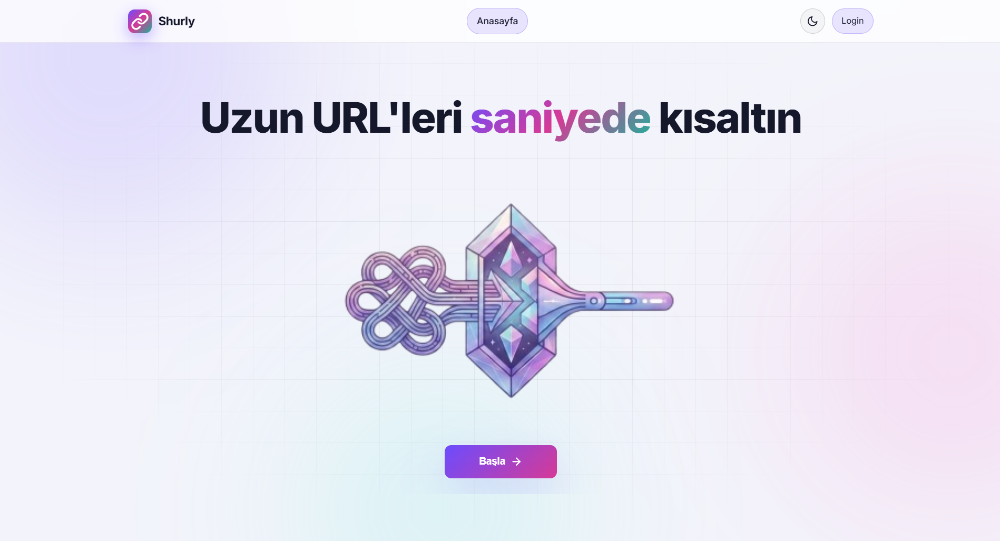
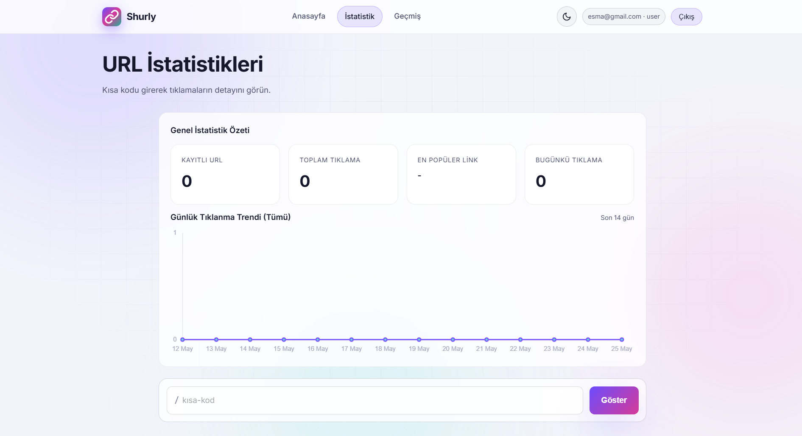
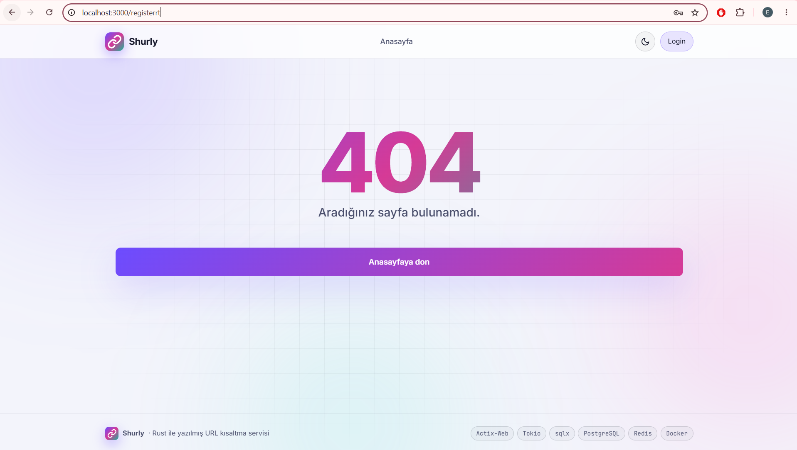
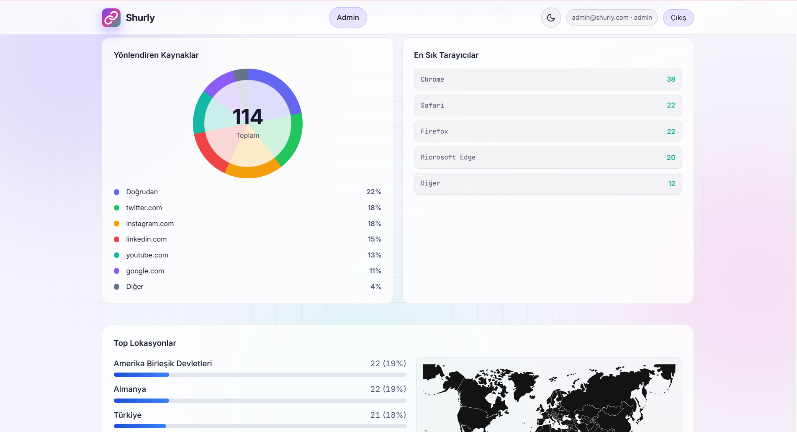

# Shurly — URL Shortener

[](https://www.rust-lang.org/)
[](https://actix.rs/)
[](https://nodejs.org/)
[](https://www.postgresql.org/)
[](https://redis.io/)
[](https://docs.docker.com/compose/)

**Shurly**, Rust + Actix-Web ile yazılmış yüksek performanslı bir URL kısaltma servisidir. Modern karanlık arayüz (Node.js + Express + EJS), PostgreSQL kalıcılığı, Redis önbelleği ve admin analitik paneli içerir.

🔗 **Repo:** [github.com/Esma-324/shurly-url-shortener](https://github.com/Esma-324/shurly-url-shortener)

---

## İçindekiler

- [Özellikler](#özellikler)
- [Mimari](#mimari)
- [Ekran görüntüleri](#ekran-görüntüleri)
- [Hızlı başlangıç](#hızlı-başlangıç)
- [API özeti](#api-özeti)
- [Yerel geliştirme](#yerel-geliştirme)
- [Klasör yapısı](#klasör-yapısı)
- [Performans](#performans)
- [Lisans](#lisans)

---

## Özellikler

| Alan | Detay |
|------|--------|
| **Kısaltma** | `POST /api/shorten` — özel kod, opsiyonel TTL |
| **Yönlendirme** | `GET /:code` — Redis → DB → `302` (tıklama logu arka planda) |
| **Analitik** | IP, User-Agent, Referrer; URL bazlı istatistik sayfası |
| **QR kod** | `GET /api/qr/:code` — vektörel SVG, renk/boyut parametreleri |
| **Admin** | Toplam URL/tıklama, trend grafiği (Chart.js), top URL listesi |
| **Güvenlik** | IP bazlı sliding-window rate limit (DashMap) |
| **Ölçek** | Redis TTL cache, atomic tıklama sayacı |
| **DevOps** | Tek komutla Docker Compose (Postgres + Redis + API + UI) |
| **Benchmark** | `wrk` + Lua senaryoları (`bench/`) |

---

## Ekran görüntüleri

| # | Dosya | Açıklama | Görsel |
|---|-------|----------|--------|
| 1 | `01-landing.png` | Landing / ana sayfa |  |
| 2 | `ana sayfa.png` | Hero alanı ve başlangıç ekranı |  |
| 3 | `giriş.png` | Kullanıcı giriş ekranı |  |
| 4 | `kayıt olma.png` | Yeni kullanıcı kayıt ekranı |  |
| 5 | `istatistik.png` | Boş istatistik dashboard görünümü |  |
| 6 | `geçmiş.png` | Geçmiş URL listesi / CRUD ekranı |  |
| 7 | `dolu istatistik.png` | Demo verilerle dolu istatistik ekranı |  |
| 8 | `detay istatistik.png` | Tek link detay analitiği |  |
| 9 | `link dağılımı nereden gelmiş.png` | Referrer ve tarayıcı dağılımı |  |
| 10 | `mobil görünüm.png` | 375 px responsive mobil görünüm |  |
| 11 | `404.png` | Hata durumu / 404 ekranı |  |
| 12 | `02-dashboard.png` | Admin dashboard / analitik görünümü |  |

---

## Mimari

```
┌─────────────┐     ┌────────────────────┐     ┌─────────────────────┐
│  Tarayıcı   │ ──▶ │  Frontend :3000    │ ──▶ │  Backend (Rust)     │
│  Dark UI    │     │  Express + EJS     │     │  Actix-Web + Tokio  │
└─────────────┘     └────────────────────┘     └──────────┬──────────┘
                                                          │
                              ┌───────────────────────────┴───────────────────────────┐
                              ▼                                                       ▼
                    ┌──────────────────┐                                 ┌──────────────────┐
                    │  PostgreSQL 16   │                                 │  Redis 7         │
                    │  sqlx (async)    │                                 │  hot URL cache   │
                    └──────────────────┘                                 └──────────────────┘
```

**Teknoloji özeti**

| Katman | Stack |
|--------|--------|
| Backend | Rust, Actix-Web 4, Tokio, Serde, sqlx |
| Veri | PostgreSQL 16, Redis 7 (`redis-rs`) |
| Frontend | Node.js 20, Express, EJS, Chart.js |
| QR | `qrcode` crate (SVG) |
| Container | Docker multi-stage + Compose |

---

## Hızlı başlangıç

**Gereksinimler:** [Docker](https://www.docker.com/) ve Docker Compose

```bash
git clone https://github.com/Esma-324/shurly-url-shortener.git
cd shurly-url-shortener
docker compose up --build
```

| Servis | URL |
|--------|-----|
| **Web arayüzü** | http://localhost:3000 |
| **API** | http://localhost:8080 |
| **Health** | http://localhost:8080/health |

Varsayılan admin (geliştirme): `admin@shurly.com` / `admin123` — üretimde `ADMIN_EMAIL` ve `ADMIN_PASSWORD` ortam değişkenlerini mutlaka değiştirin.

> Kısa linkler `PUBLIC_BACKEND_URL` ile üretilir. Farklı host/port için `docker-compose.yml` içindeki `BASE_URL` ve `PUBLIC_BACKEND_URL` değerlerini güncelleyin.

---

## API özeti

### URL kısalt

```http
POST /api/shorten
Content-Type: application/json
```

```json
{
  "url": "https://example.com/uzun-bir-adres",
  "custom_code": "benim-kodum",
  "expires_in_days": 30
}
```

### Yönlendirme

```http
GET /:code
```

→ `302` ile hedef URL; tıklama kaydı async yazılır.

### Diğer uçlar

| Endpoint | Açıklama |
|----------|----------|
| `GET /api/stats/:code` | URL detayı ve tıklama analitiği |
| `GET /api/qr/:code` | SVG QR (`?size=512&dark=000&light=fff`) |
| `GET /api/admin/overview` | Genel özet istatistikler |
| `GET /api/admin/timeseries?days=14` | Günlük tıklama serisi |

Tam API örnekleri ve yanıt şemaları için proje içi dokümantasyona bakın.

---

## Yerel geliştirme

PostgreSQL ve Redis'in çalışıyor olması gerekir (Docker ile sadece `postgres` + `redis` servislerini de ayağa kaldırabilirsiniz).

**Backend**

```bash
cd backend
cp .env.example .env
cargo run --release
```

**Frontend**

```bash
cd frontend
npm install
set BACKEND_URL=http://localhost:8080
set PUBLIC_BACKEND_URL=http://localhost:8080
npm start
```

Migrasyonlar backend açılışında otomatik uygulanır.

---

## Klasör yapısı

```
shurly-url-shortener/
├── backend/          # Rust API (Actix-Web, handlers, middleware)
├── frontend/         # Express + EJS arayüzü
├── bench/            # wrk benchmark scriptleri
├── docker-compose.yml
└── README.md
```

---

## Performans

`bench/` klasöründe redirect, shorten ve health senaryoları için `wrk` scriptleri vardır. Rust + Redis ile redirect uç noktasında tipik geliştirme makinesinde **~25k req/s** ve p95 **~5 ms** civarı ölçümler alınabilir (donanıma göre değişir).

```bash
wrk -t8 -c200 -d30s -s bench/redirect.lua http://localhost:8080
```

Ayrıntılar: [bench/README.md](bench/README.md)

---

## Lisans

Bu proje eğitim ve portföy amaçlı geliştirilmiştir. Kullanım ve lisans koşulları için depo sahibiyle iletişime geçin.

---

<p align="center">
  <strong>Shurly</strong> — kısa linkler, hızlı yönlendirme, net analitik.
  <br />
  <sub>Esma-324 · Rust + Node.js full-stack</sub>
</p>
